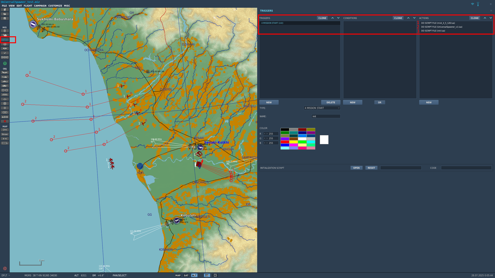

# DCS-UniversalSpawner
DCS Universal AI Group Spawner Script

## Description
A revised version of the previous [spawner script](https://github.com/s3antuan/DCS-Randomized-Spawner) rewrote with [MIST](https://github.com/mrSkortch/MissionScriptingTools). 

### Key Features
- Spawn AI group with:
  - Random routes
  - Random unit templates
  - Variation in waypoint location within a radius
  - Variation in waypoint height (for airborne unit only)
- Scheduled spawn with:
  - 8 available preset levels
  - Multiple schedules can be set within each level
  - Now only the preset schedules within the currently level is active (unlike the previous version script)
  - Limit for number of groups spawned by schedule in total
  - Limit for number of groups spawned by schedule currently on the map at any given time
- Option for in-game spawner control via F10 menu:
  - Spawn one group instantly
  - Change scheduled spawn level
  - Additional helper function for checking spawners' status
- Redesign to better support for integration with other scripts

## Setup in Mission Editor
### Script Setup
**This script requires MIST version [4.5.128](https://github.com/mrSkortch/MissionScriptingTools/tree/development) or above.** 

First, in the trigger tab, load MIST at mission start via DO SCRIPT FILE.

Second, load UniversalSpawner via DO SCRIPT FILE.

Last, load your own script containing the settings for spawners either via DO SCRIPT FILE or DO SCRIPT `assert(loadfile("PATH-TO-YOUR-SCRIPT"))()` if you want to avoid reload everytime after making a change.



### Placing Routes and Templates
Routes and templates are groups placed in mission editor for the spawner to take informations from.

**_Routes_** are where the spawner will choose to spawn units from. Set as late activation and things below: 
- Waypoints
- Tasks
- Addvance waypoint options
- AI difficulty

**_Templates_** can be placed anywhere on the map. Set as late activation and things below: 
- Vehicle type
- Number of vehicles per group
- Loadout
- Livery

Some notes:
- Each spawner includes ONLY ONE unit category (airplane, helicopter, ground unit, or ship).
- Each spawner corresponds to ONLY ONE task (e.g. CAP, CAS, ground attack, etc.)
- Routes and templates can be shared between different spawners as long as they have the same unit category and task.
- Name the group name of routes and templates accordingly! This will make your life easier later.

### Spawner Setup
First, create two tables containing the group names of routes and templates respectively.
```lua
local routeTbl = {"route_001", "route_002", "route_003", "route_004"}
local templateTbl = {"template_001", "template_002", "template_003"}
```
Second, create an UniversalSpawner instance.
```lua
-- Create a spawner with a name "MySpawner" without F10 menu
local spawner = UniversalSpawner:New("MySpawner", routeTbl, templateTbl)

-- OR
-- Create a spawner with F10 menu options for the blue side, situated inside the submenu "MySubMenu"
local spawner = UniversalSpawner:New("MySpawner", routeTbl, templateTbl, "MySubMenu", coalition.side.BLUE)
```
Then, add some settings to the spawner and call the function `UniversalSpawner:Run()` last. The spawner will start working.
```lua
-- Add some settings
-- Set the schedules for some levels
spawner:SetScheduleTable(1, {})
spawner:SetScheduleTable(2, {{600, 0.5}, {900, 0.5}})
spawner:SetScheduleTable(3, {{240, 0.2, 240, 0.2}})
spawner:SetScheduleTable(4, {{120, 0.4, 120, 0.4, 3000}})

-- Set variation for waypoints
spawner:SetRouteVar(36000, 4000)

-- Set initial level at start
spawner:SetLevel(2)

-- Last
spawner:Run()
```
Additionally, to add a F10 menu sommand to show the status of your spawners:
```lua
-- Create a table of all your spawners you want to check
local spawnerTbl = {spawner_1, spawner_2, spawner_3, spawner_4}

-- The helper function
MenuShowSpawnerStatus(spawnerTbl)
```
## Examples
_WIP_

## Documents
### `UniversalSpawner:New(name, routeTbl, templateTbl, subMenu, menuSide)`
UniversalSpawner constructor.

**Parameters:**
<table>
  <tr>
    <td>#string <b>name</b></td>
    <td>Name of the spawner shown in the spawned group names and in the F10 menu (if set).</td>
  </tr>
  <tr>
    <td>#table of #string <b>routeTable</b></td>
    <td>Group names in ME set as routes for spawn.</td>
  </tr>
  <tr>
    <td>#table of #string <b>templateTable</b></td>
    <td>Group names in ME set as templates for spawn.</td>
  </tr>
  <tr>
    <td>#string <b>subMenu</b></td>
    <td>(Optional) Name of the sub menu branch in F10 menu. Default is nil (no F10 menu will be added).</td>
  </tr>
  <tr>
    <td>#table/enum <a href="https://wiki.hoggitworld.com/view/DCS_enum_coalition">coalition.side</a> <b>menuSide</b></td>
    <td>(Optional) Coalition in which the F10 menu will be added. Default is nil (added for all).</td>
  </tr>
</table>

**Return values:**
<table>
  <tr>
    <td>#UniversalSpawner</td>
    <td>self</td>
  </tr>
</table>

---
### `UniversalSpawner:SpawnAI(scheduled)`
Spawn a group into the map. 

If parameter "scheduled" is set to true, total limit and on-field limit checks will apply. Normally you should just leave it empty.

**Parameters:**
<table>
  <tr>
    <td>#boolean <b>scheduled</b></td>
    <td>(Optional) Whether is scheduled spawn or not. Default is false.</td>
  </tr>
</table>

**Return values:**
<table>
  <tr>
    <td>#nil</td>
  </tr>
</table>

---
### `UniversalSpawner:SetRouteVar(radiusVar, heightVar)`
Set the variation of waypoint locations. Only apply to waypoints with type "turning point". Both value should be ≥ 0.

**Parameters:**
<table>
  <tr>
    <td>#number <b>radiusVar</b></td>
    <td>Radius variation of waypoints (in ft.)</td>
  </tr>
  <tr>
    <td>#number <b>heightVar</b></td>
    <td>Height variation of waypoints (in ft.) For ground units this will be ignored.</td>
  </tr>
</table>

**Return values:**
<table>
  <tr>
    <td>#nil</td>
  </tr>
</table>

---
### `UniversalSpawner:SetLevel(level, hasMessage)`
Set/Change the current scheduled spawn level. Default is 1.

**Parameters:**
<table>
  <tr>
    <td>#number <b>level</b></td>
    <td>The current level of scheduled spawn to be set (1 ~ 8).</td>
  </tr>
  <tr>
    <td>#boolean <b>hasMessage</b></td>
    <td>(Optional) Show message in log and in game. Default is false.</td>
  </tr>
</table>

**Return values:**
<table>
  <tr>
    <td>#nil</td>
  </tr>
</table>

---
### `UniversalSpawner:SetScheduledSpawnLimit(limit)`
Set the limit of total scheduled spawns.

**Parameters:**
<table>
  <tr>
    <td>#number <b>limit</b></td>
    <td>The number limit of total scheduled spawns. Set to 0 means no limit.</td>
  </tr>
</table>

**Return values:**
<table>
  <tr>
    <td>#nil</td>
  </tr>
</table>

---
### `UniversalSpawner:SetOnFieldSpawnLimit(limit)`
Set the limit of on-field scheduled spawns at any time. 

Scheduled spawn will pause if limit is reached. No effect on groups spawned by calling `UniversalSpawner:SpawnAI()` directly or using F10 menu command "Spawn One Group Now".

**Parameters:**
<table>
  <tr>
    <td>#number <b>limit</b></td>
    <td>The number limit of on field scheduled spawns. Set to 0 means no limit.</td>
  </tr>
</table>

**Return values:**
<table>
  <tr>
    <td>#nil</td>
  </tr>
</table>

---
### `UniversalSpawner:SetScheduleTable(level, schedules)`
Set the schedules of scheduled spawn for each level. This function should be called BEFORE `UniversalSpawner:Run()`.

Only the levels set via this function will be shown in the F10 menu as an option.

Only the schedules of the current level will be active.

**Parameters:**
<table>
  <tr>
    <td>#number <b>level</b></td>
    <td>The level of scheduled spawn to set schedules (1 ~ 8).</td>
  </tr>
  <tr>
    <td>#table of #table <b>schedules</b></td>
    <td>See below.</td>
  </tr>
</table>

**Return values:**
<table>
  <tr>
    <td>#nil</td>
  </tr>
</table>

#### Schedule table

Parameter **schedules** is a table of tables looks like below:

`{ {A, B, C, D, E}, {A, B, C, D, E}, ... }`, where:

- **A:** time for the first spawn.
- **B:** time variation of the first spawn (0 ~ 1) i.e., actual time for the first spawn = A ± (A * B)
- **C:** time interval between each subsequent spawns.
- **D:** time variation of subsequent spawns (0 ~ 1) i.e., actual time for the spawn = A + C * i ± (C * D) where i = 1, 2, 3, ...
- **E:** time for the scheduled spawning to stop.

All unit in seconds. Time count begins when `UniversalSpawner:Run()` is called.

Examples:

- Empty `{}` spawns nothing.
- `{A, B, nil, nil, nil}` or `{A, B}` spawns only once.
- `{A, B, C, D, nil}` or `{A, B, C, D}` spawns repeatly on schedule.
- `{A, B, C, D, E}` spawns repeatly on schedule until stop time is reached.

---
### `UniversalSpawner:Run()`
Activate the spawner. 

**Parameters:**
<table>
  <tr>
    <td>#nil</td>
  </tr>
</table>

**Return values:**
<table>
  <tr>
    <td>#nil</td>
  </tr>
</table>

---
### `MenuShowSpawnerStatus(UniversalSpawnerTbl, menuText)`
A helper function to create a F10 menu command for checking spawners' status.

**Parameters:**
<table>
  <tr>
    <td>#table of #UniversalSpawner <b>UniversalSpawnerTbl</b></td>
    <td>Table of UniversalSpawner instances. Any element not a table (such as a string) will create a blank line for better readability.</td>
  </tr>
  <tr>
    <td>#string <b>menuText</b></td>
    <td>(Optional) Alternative text for F10 menu command.</td>
  </tr>
</table>

**Return values:**
<table>
  <tr>
    <td>#nil</td>
  </tr>
</table>

---
